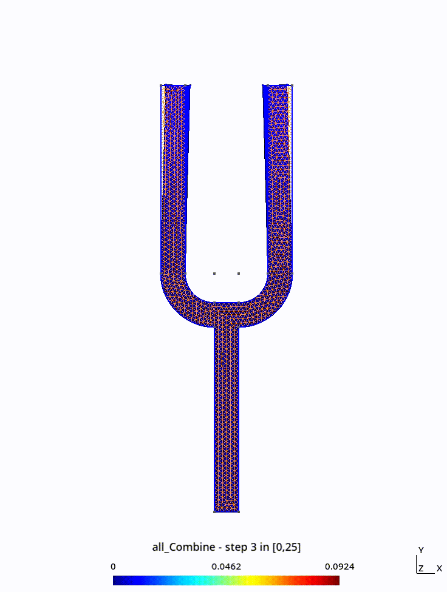
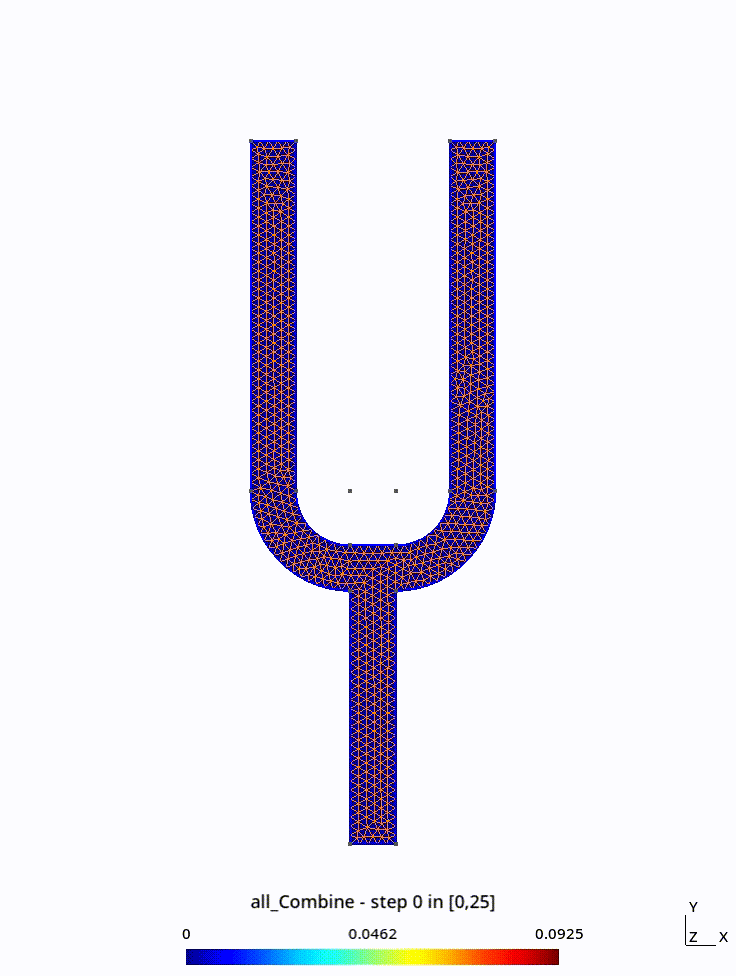
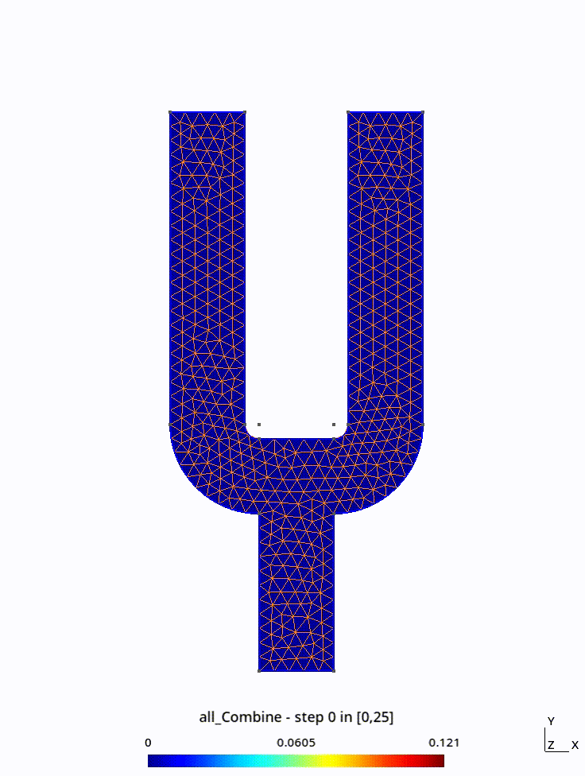
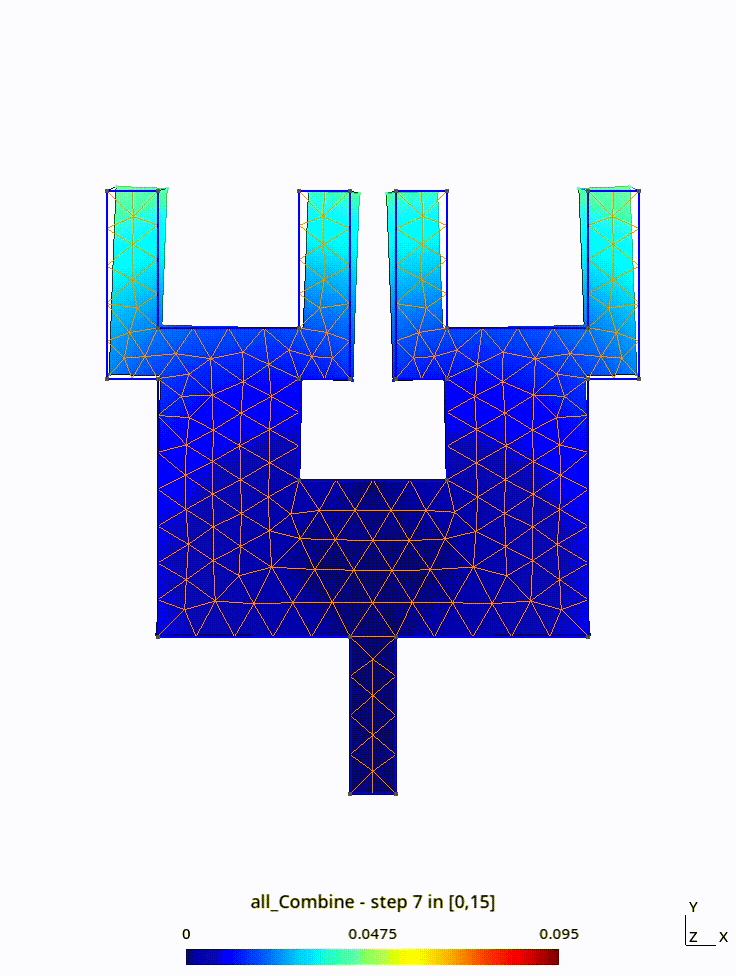
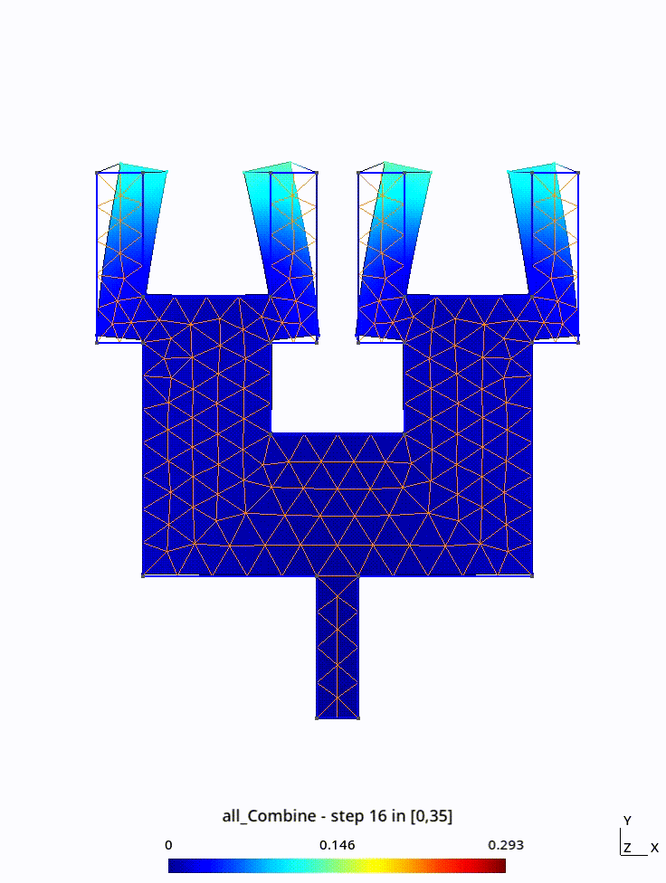

# Dimensionner un diapason pour sonner à la fréquence de la note G6

| Bisection | Ternary Search | Descente de gradient | 2 Couches mode 1 | 2 couches mode 2 |
| --------- | -------------- | -------------------- | --------- | ------ |
|  |  |  |  |  |

## Simple dimensionnement


### Lancer bisect

Pour lancer la bisection

```make bisect && ./bisect -v 0```

### Ternary search

```make ternary_search && ./ternary_search -v 0```

### Descente de gradient

```make gradient_descent && ./gradient_descent -v 0```

### En python

D'abord il faut les requirements et build les bindings c->python

```pip install scipy && make python_functions```

On peut lancer les optimisations avec

```python optimize.py```

### Visualisation des résultats

modifié le fichier project.c avec vos valeurs et faites

```make && ./project k file```

où k représente le nombre de modes à calculer et file le fichier ou sont écrit les fréquences

## Diapason multi-couches

```make multi_layer && ./multi_layer k f```

L'optimisation se trouver dans le fichier python.

## Contraintes sur la taille

```make constant_area_bisect && ./constant_area_bisect -v 0```

